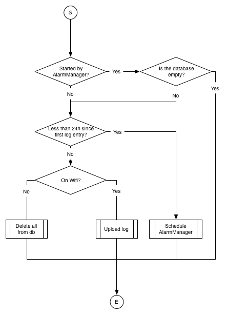

Android Test Lab
================

TDD with kata
-------------
http://osherove.com/tdd-kata-1/

TDD with Fizz-Buzz
------------------
The goal of this exercise is to try out TDD and pair programing. This will be done in teams of two people taking turns writing tests and the code to make failing tests pass.

The problem that you will work on to get the exercise going is generaly known as Fizz-Buzz, a short description of Fizz-Buzz can be found below.

Fizz-Buzz:
For n in the range 1 to 99:
if n is dividable by 3 and 5: return with 'FizzBuzz'
else if n is dividable by 3: return with 'Fizz'
else if n is dividable by 5: return with 'Buzz'
else return n

We want you to implement the following interface:

String[] getFizzbuzz(int[] numbers);

Take turns doing one "Test-driven development cycle" each until a complete implementation to the above interface have been achived.

http://en.wikipedia.org/wiki/Test-driven_development#Test-driven_development_cycle

Refactoring for Testability Lab
-------------------------------

The goal of this exercise is to write tests to validate the scheduling algorithm in the LoggerService class. The algorithm is as follows:

1. If the service was started by the AlarmManager and the database is empty: Exit.
2. If less than a day has passed since the first log entry was written to the database, schedule the service to be restarted 24 hours after the timestamp of that log entry, then exit.
3. If we are on wifi, send the log entries to the server, then exit.
4. Otherwise, wipe the database and exit.

These steps are illustrated in the following flowchart:

Suggested steps for a solution:

* Create an Android Instrumentation Test project. Also create a dummy test to check that 1 + 1 = 2, to see that it works.
* Move the actual algorithm to a separate class (LoggerScheduler) that is easier to instantiate and test than a Service.
* Move all database dependencies to a helper class that can be instantiated and injected to the LoggerScheduler. This lets you create a fake version of the database functionality in your tests, to simulate different states. (See http://stackoverflow.com/a/130862/638902 for a short description of dependency injection.)
* Write a test to verify the first point in the algorithm above.
* Inject the Dispatcher and the PhoneInfo objects as well, to help with further state simulations.
* Write tests for the rest of the algorithm. Make sure that all exit points are covered.

